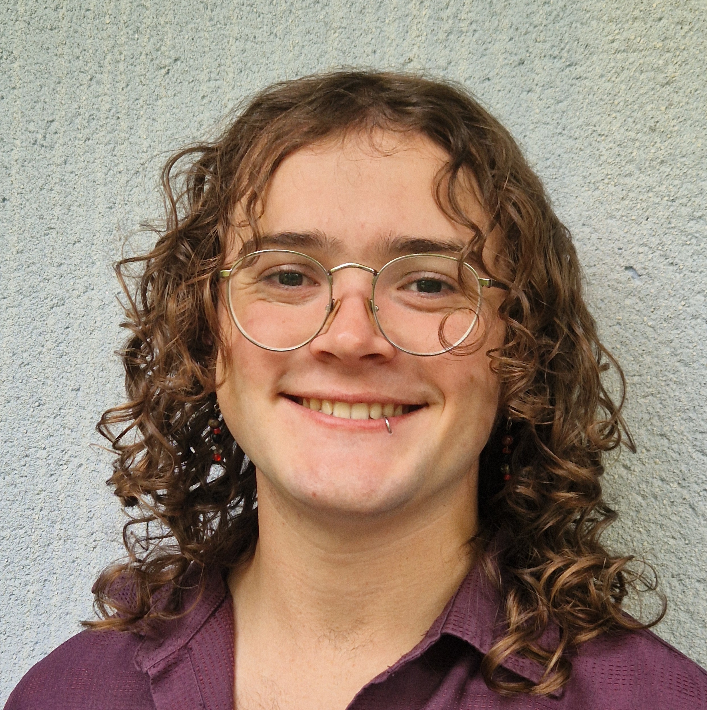

+++
title = "Front Page"

[extra]
framed = true
section_path = "blog/_index.md"
max_posts = 0
stylesheets = ["extra.css"]
+++

    
    

        Amos Holland (he/they)  
        ---------------------------------------  
        PhD Student @ The University of Bristol 
        ---------------------------------------  
        amos.holland@bristol.ac.uk  

# About
Hello, I'm Amos (he/they)! I'm a PhD student at the University of Bristol in the [Programming Languages Research Group](https://plrg-bristol.github.io/), supervised by [Dr. Steven Ramsay](https://sjrsay.github.io/). 

I'm also currently serving as the student representative for Computer Science PGRs at Bristol.

# Research Interests
I enjoy pretty much all things PL, but I'm particularly interested in type systems and their application to practical problems. Some areas I am particularly interested in are:
- Types For Incorrectness
- Error Detection in Dynamically Typed Languages
- Static Analysis in Languages with Objects
